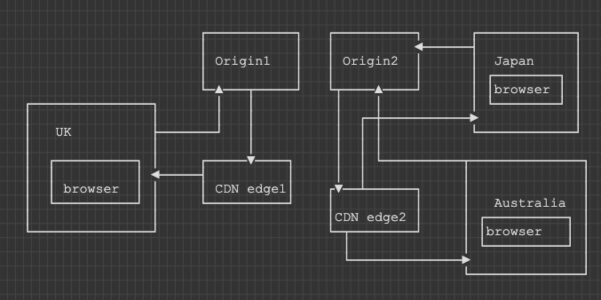

# Region-aware content storage and serving

## What?
Content storage and serving dependent on user geolocation

## Why?
1. User needs to have optimal latency to our server
    1. Or we risk providing a bad (slow) user experience
1. We ingest user content and process into a "proprietary" format
    1. Users pay per content ingested
1. We profit from the margin against infrastructure cost
1. Our processed content can size from 1GB to 500GB
1. We serve processed content back to user for browser rendering

## Who is affected?
1. Our users are paying customers who expects the best value for service

## How?

### Diagram

Arrow flow == data flow.

### Steps

1. User (represented by 'browser' above) is given by Frontend/Backend a presigned URL to upload onto a specific Origin
1. Frontend will wait until processing is done
    1. Frontend displays progress bar
    1. When finished, frontend will request CDN for processed output
1. Nearest CDN edge will answer request with content from nearest Origin

### Assumptions
1. User is always producing and consuming content from same region (non-ideal)

## SLA

1. System is expected to be available >= 99.99%
    1. Measured monthly to decide on actions to improve availability
1. Latency expectation of download from CDN edge of pre-processed sample 200GB file
    1.  Non-cached at edge <= 10 seconds
    1.  Cached at edge <= 7 seconds
1. Data throughput expectation from CDN edge or Origins: non-specified.
